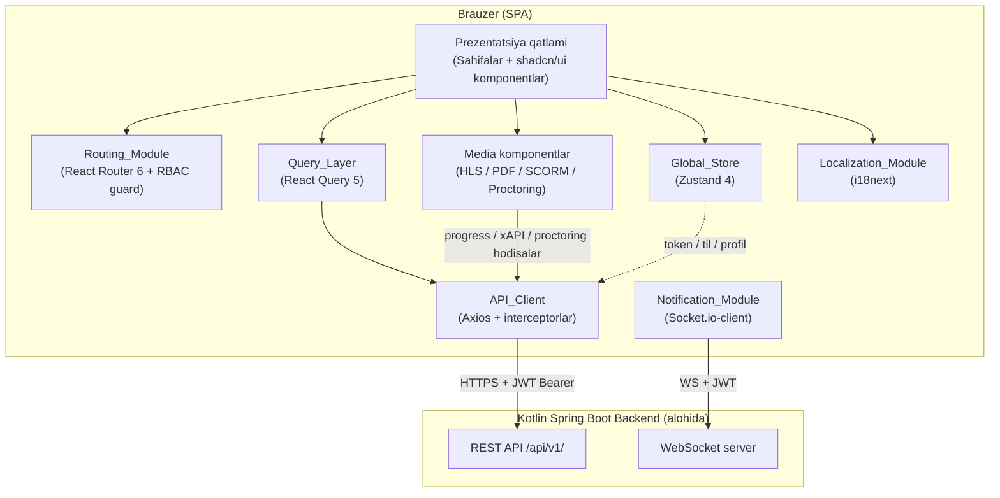
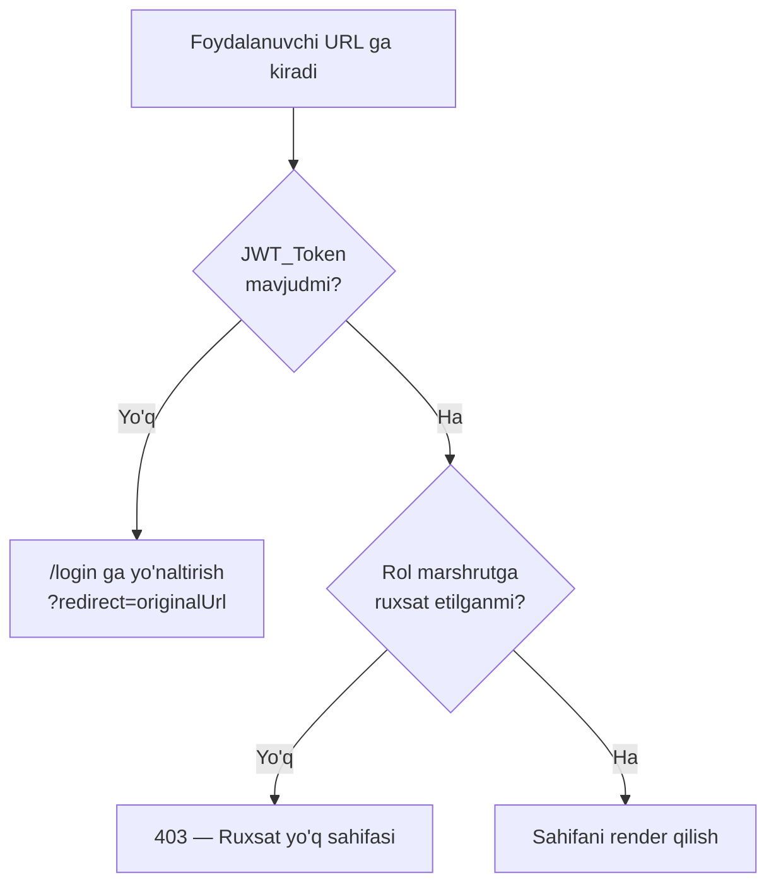
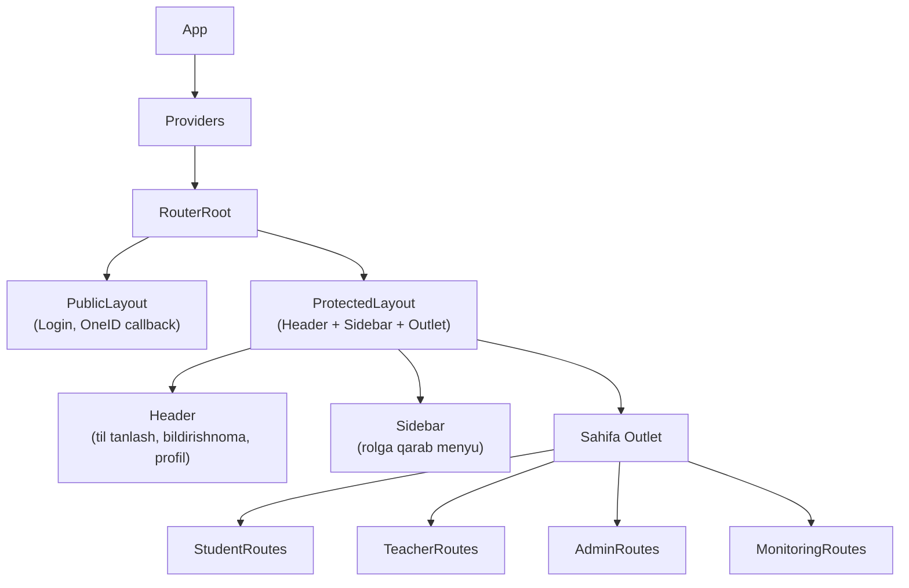
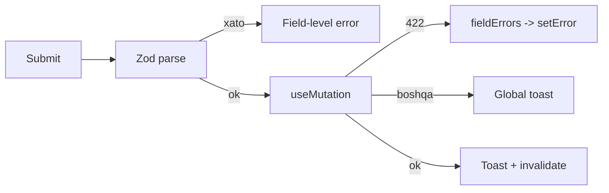

# Dizayn Hujjati — LMS Frontend

## Overview

Mazkur hujjat O'zbekiston Respublikasi Vazirlar Mahkamasining 2022-yil 3-oktyabrdagi 559-son qarori asosida masofaviy ta'lim tizimining **faqat frontend qismi** uchun texnik dizaynni belgilaydi. Frontend brauzerda ishlaydigan Single Page Application (SPA) bo'lib, alohida rejalashtiriladigan Kotlin Spring Boot backend tomonidan taqdim etiladigan REST API (`/api/v1/`) va WebSocket interfeyslarini iste'mol qiladi. Backend ichki tuzilishi mazkur hujjat doirasidan tashqarida — bu yerda faqat frontend arxitekturasi, komponentlar ierarxiyasi, holat boshqaruvi, media komponentlar, API mijoz qatlami, xatolarni qayta ishlash, testlash strategiyasi hamda qulaylik (accessibility) va ko'p tillilik yondashuvi tavsiflanadi.

### Texnologiyalar to'plami

| Soha | Texnologiya | Sabab |
|------|-------------|-------|
| Asosiy freymvork | React 18 + TypeScript 5 | Komponentga asoslangan UI, qat'iy tip xavfsizligi |
| Build vositasi | Vite | Tez HMR, optimallashtirilgan bundling |
| UI kutubxonasi | shadcn/ui + TailwindCSS | Radix asosida qulay (accessible) komponentlar, dizayn moslashuvchanligi |
| Server holati | React Query 5 (TanStack Query) | Keshlash, qayta urinish, fonda yangilash |
| Mijoz holati | Zustand 4 | Yengil global store (foydalanuvchi, til, mavzu) |
| HTTP mijoz | Axios | Interceptor orqali JWT va xatolarni markazlashtirish |
| Real vaqt | Socket.io-client | Bildirishnomalar uchun WebSocket |
| Video | HLS.js | Adaptiv bitrate `.m3u8` oqimi |
| PDF | react-pdf (pdf.js) | Brauzerda PDF render qilish |
| SCORM | iframe + SCORM API shim | SCORM 1.2 / 2004 paketlari |
| Proktoring | face-api.js | Kameradan yuzni aniqlash |
| Marshrutlashtirish | React Router 6 | Deklarativ, rolga asoslangan kirish |
| Ko'p tillilik | i18next + react-i18next | uz/ru/en, runtime almashtirish |
| Forma | React Hook Form + Zod | Validatsiya va tip xavfsizligi |
| Test | Vitest + React Testing Library + fast-check | Birlik, integratsiya va xususiyatga asoslangan testlar |

### Dizayn prinsiplari

1. **Layer ajratish**: Transport (API_Client) → Server holati (Query_Layer) → Mijoz holati (Global_Store) → Prezentatsiya (komponentlar). Har bir qatlam mustaqil sinaladi.
2. **Toza logika ajratish**: Biznes qoidalari (rol tekshiruvi, kontingent chegaralari, backoff hisoblash, til fallback) toza, side-effect siz funksiyalar sifatida ajratiladi — bu xususiyatga asoslangan testlashni (PBT) imkon beradi.
3. **Deklarativ kirish nazorati**: Marshrut himoyasi konfiguratsiya orqali belgilanadi, imperativ tekshiruvlar tarqalmaydi.
4. **Backend "haqiqatning yagona manbai"**: Frontend faqat UI holatini boshqaradi; biznes ma'lumotlari serverdan keladi va React Query orqali keshlanadi.

## Architecture

### Yuqori darajadagi qatlamlar



### Loyiha tuzilishi (papka tuzilmasi)

```
src/
├── main.tsx                      # Kirish nuqtasi, providerlar
├── App.tsx                       # Root router
├── app/
│   ├── providers.tsx             # QueryClient, i18n, Theme, Auth providerlar
│   └── router.tsx                # Marshrut konfiguratsiyasi (RBAC bilan)
├── shared/
│   ├── api/
│   │   ├── client.ts             # Axios instance + interceptorlar
│   │   ├── auth-interceptor.ts   # JWT qo'shish + 401 refresh
│   │   ├── retry.ts              # 5xx eksponensial backoff (toza logika)
│   │   └── endpoints.ts          # Endpoint URL konstantalari
│   ├── auth/
│   │   ├── token-storage.ts      # Token saqlash/o'qish/o'chirish
│   │   ├── session.ts            # Sessiya taymer (30 daqiqa inactivity)
│   │   └── rbac.ts               # Rol → ruxsat etilgan marshrutlar (toza logika)
│   ├── i18n/
│   │   ├── config.ts             # i18next sozlamasi + fallback
│   │   └── locales/{uz,ru,en}.json
│   ├── store/
│   │   ├── auth-store.ts         # Zustand: foydalanuvchi, tokenlar
│   │   ├── ui-store.ts           # Zustand: til, mavzu, sidebar
│   │   └── notification-store.ts # Zustand: bildirishnomalar, unread soni
│   ├── ui/                       # shadcn/ui komponentlar (generatsiya qilingan)
│   ├── components/               # Umumiy komponentlar (DataTable, Pagination...)
│   ├── lib/
│   │   ├── backoff.ts            # Eksponensial backoff ketma-ketligi (toza)
│   │   ├── contingent.ts         # Kontingent chegara validatsiyasi (toza)
│   │   ├── ratio.ts              # Teacher_Student_Ratio hisoblash (toza)
│   │   └── validation.ts         # Zod sxemalar (shikoyat min uzunlik...)
│   └── types/                    # TypeScript API tiplari
├── features/
│   ├── auth/                     # Login, OneID callback
│   ├── student/                  # Student_Panel sahifalari
│   ├── teacher/                  # Teacher_Panel sahifalari
│   ├── admin/                    # Admin_Panel + HEMIS_Sync_UI
│   ├── monitoring/               # Monitoring_Panel
│   ├── video/                    # Video_Player
│   ├── pdf/                      # PDF_Viewer
│   ├── scorm/                    # SCORM_Player + API shim
│   ├── test-taking/              # Test_Module
│   ├── proctoring/               # Proctoring_Module
│   ├── attendance/               # Attendance_Module
│   ├── certificates/             # Certificate_Module
│   ├── complaints/               # Complaint_Module
│   ├── notifications/            # Notification_Module (Socket.io)
│   └── reports/                  # Reports_Module
└── test/
    ├── setup.ts
    └── generators.ts             # fast-check generatorlari
```

### Marshrutlashtirish arxitekturasi (Routing_Module)

Marshrutlar deklarativ konfiguratsiya orqali himoyalanadi. Har bir himoyalangan marshrut talab qilinadigan rollar ro'yxatini e'lon qiladi (Req 2.8). `ProtectedRoute` guard komponenti `rbac.ts` dagi toza funksiyaga tayanadi.



Rol → boshlang'ich sahifa moslashuvi (Req 2.2–2.5):

| Rol | Boshlang'ich URL |
|-----|------------------|
| STUDENT | `/student/dashboard` |
| TEACHER | `/teacher/dashboard` |
| OTM_ADMIN, DEKAN | `/admin/dashboard` |
| SUPER_ADMIN | `/monitoring/dashboard` |

### Komponentlar ierarxiyasi



## Components and Interfaces

### API_Client (Axios qatlami)

Markazlashtirilgan Axios instance barcha so'rovlarni `/api/v1/` prefiksiga yuboradi (Req 21.1) va har bir so'rovga JWT Bearer sarlavhasini avtomatik qo'shadi (Req 21.2).

```typescript
// shared/api/client.ts
const apiClient = axios.create({
  baseURL: "/api/v1",
  timeout: 30000,
});

// So'rov interceptori — JWT qo'shish
apiClient.interceptors.request.use((config) => {
  const token = tokenStorage.getAccessToken();
  if (token) config.headers.Authorization = `Bearer ${token}`;
  return config;
});

// Javob interceptori — 401 refresh va 5xx retry
apiClient.interceptors.response.use(
  (res) => res,
  async (error) => handleResponseError(error, apiClient),
);
```

**401 refresh oqimi** (Req 1.6, 1.7, 21.3): 401 javobida `API_Client` bir martta refresh token bilan yangi access token olishga uradi. Bir vaqtning o'zida kelgan ko'p 401 lar uchun refresh so'rovi navbatga qo'yiladi (single-flight) — takroriy refresh oldini olinadi. Refresh muvaffaqiyatsiz bo'lsa, tokenlar o'chiriladi va `/login` ga yo'naltiriladi.

**5xx retry oqimi** (Req 21.4): 5xx javoblarida eksponensial backoff bilan 3 martagacha qayta uriniladi. Backoff ketma-ketligi `shared/lib/backoff.ts` dagi toza funksiya orqali hisoblanadi va shu funksiya alohida sinaladi.

```typescript
// shared/lib/backoff.ts — toza funksiya (PBT uchun)
export function backoffDelays(maxRetries: number, baseMs = 1000): number[] {
  return Array.from({ length: maxRetries }, (_, i) => baseMs * 2 ** i);
}
```

### Auth_Module

| Funksiya | Tavsif | Requirement |
|----------|--------|-------------|
| `LoginPage` | Login/parol forma, OneID tugma, til tanlash | 1.1 |
| `login(credentials)` | JWT olish va saqlash, rolga yo'naltirish | 1.2 |
| `OneIDButton` | OAuth avtorizatsiya URL ga yo'naltirish | 1.4 |
| `OneIDCallback` | `code` ni backendga yuborish, token saqlash | 1.5 |
| `logout()` | Backend logout, tokenlarni tozalash | 1.8 |
| `useSessionTimeout()` | 30 daqiqa harakatsizlikda sessiyani yakunlash | 1.9 |

Sessiya taymeri foydalanuvchi harakatlarini (mouse, klaviatura, skroll) kuzatadi va har harakatda taymerni qayta tiklaydi. 30 daqiqa harakatsizlikdan so'ng `logout` ishga tushadi.

### Media komponentlar

**Video_Player (HLS.js)** — Req 4

- `.m3u8` oqimni HLS.js orqali ijro etadi; native HLS qo'llab-quvvatlanadigan brauzerlarda (Safari) native rejimga tushadi.
- Boshqaruvlar: play/pause, seek bar, ovoz, to'liq ekran, ijro tezligi (0.5x–2x).
- Har 10 soniyada hozirgi pozitsiyani backendga yuboradi (`POST /progress/video`).
- Ulanish tiklanganda oxirgi saqlangan pozitsiyadan davom etadi (`resumePosition`).
- Klaviatura: probel = play/pause, ←/→ = 5s orqaga/oldinga.

**PDF_Viewer (react-pdf)** — Req 5: sahifa navigatsiyasi, zoom, to'liq ekran, matn qidirish, xato holatida alternativ yuklab olish havolasi.

**SCORM_Player (iframe + API shim)** — Req 6

SCORM paket iframe ichida yuklanadi. `window.API` (SCORM 1.2) va `window.API_1484_11` (SCORM 2004) global obyektlari iframe yuklanishidan oldin e'lon qilinadi. Shim quyidagi chaqiriqlarni qabul qiladi: `LMSInitialize`, `LMSGetValue`, `LMSSetValue`, `LMSCommit`, `LMSFinish` (va 2004 ekvivalentlari).

```mermaid
sequenceDiagram
    participant Iframe as SCORM paket (iframe)
    participant Shim as SCORM API Shim
    participant Backend
    Iframe->>Shim: LMSInitialize("")
    Shim-->>Iframe: "true"
    Iframe->>Shim: LMSSetValue("cmi.core.lesson_status","completed")
    Shim->>Backend: POST /scorm/xapi (status o'zgardi)
    Iframe->>Shim: LMSCommit("")
    Iframe->>Shim: LMSFinish("")
    Shim->>Backend: POST /scorm/xapi (yakuniy holat)
```



`lesson_status` (1.2) yoki `completion_status` (2004) o'zgarganda xAPI hodisasi backendga yuboriladi (Req 6.3). Status normalizatsiyasi (1.2 ↔ 2004 qiymatlarini umumiy modelga keltirish) `shared/lib` dagi toza funksiya orqali bajariladi va sinaladi.

**Proctoring_Module (face-api.js)** — Req 8

- Kamera/mikrofon ruxsati so'raladi; ruxsat berilmasa testni boshlash bloklanadi.
- Test boshlanishidan oldin kamera preview ko'rsatiladi va talaba tasdiqlaydi.
- Har 10 soniyada face-api.js yuzni aniqlaydi; natija backendga yuboriladi.
- 0 ta yoki >1 yuz aniqlansa "violation" hodisasi yuboriladi va talabaga ogohlantirish ko'rsatiladi.
- `visibilitychange`/`blur` hodisalari orqali tab almashtirish "tab_switch" sifatida yuboriladi.

Yuz aniqlash natijasini hodisa turiga aylantiruvchi logika (`faceCount → eventType`) toza funksiya: `0 yoki >1 → violation`, `1 → ok`.

### Test_Module — Req 7

- Test boshida savollar, taymer va proktoring sozlamalari olinadi.
- Yuqorida orqaga sanovchi taymer va javob progress bari.
- Savol navigatsiyasi, "ko'rib chiqish" belgisi, savollar panel.
- Javob 5 soniyalik debounce bilan avtomatik saqlanadi.
- Taymer 0 ga yetganda avtomatik yakunlash; qo'lda yakunlashda tasdiqlash dialogi.
- Ulanish uzilsa saqlanmagan javoblar navbatga qo'yiladi va tiklanganda qayta yuboriladi.

### Admin/Monitoring/Reports/HEMIS

- **Admin_Panel** (Req 11): foydalanuvchi/kurs ro'yxatlari filtrlar bilan; kurs yaratish formasida kontingent chegarasi vizual indikatori va validatsiya bloklash (Bachelor ≤ 300, Master ≤ 30).
- **HEMIS_Sync_UI** (Req 12): sinxronlash tugmalari, polling orqali holat (har 5s), yakuniy hisobot, tarix jadvali, xato loglarini yuklab olish.
- **Monitoring_Panel** (Req 13): indikator kartochkalar, OTM bo'yicha Teacher_Student_Ratio jadval/diagramma, 1:50 dan oshganda qizil ajratish, sana filtri, CSV/PDF eksport.
- **Reports_Module** (Req 17): hisobot turlari, filtrlar (1s debounce), CSV/PDF eksport, eksport vaqtida tugma blokirovkasi.

### Notification_Module — Req 16

Tizimga kirgandan so'ng Socket.io-client JWT bilan WebSocket serverga ulanadi. Yangi bildirishnoma kelganda toast ko'rsatiladi va unread sanovchi oshiriladi. Ulanish uzilganda eksponensial backoff (1, 2, 4, 8, 16 soniya) bilan qayta ulanishga uriniladi — bu ketma-ketlik ham `backoff.ts` toza funksiyasidan kelib chiqadi.

### Localization_Module — Req 19

i18next uz (default), ru, en tillarini qo'llab-quvvatlaydi. Til Header dan almashtiriladi (sahifa qayta yuklanmaydi), tanlov `localStorage` da saqlanadi. Tarjima kaliti topilmasa uz fallback ishlaydi.

## Data Models

Quyidagi TypeScript tiplari backend REST API javoblariga mos keladi. Ular `shared/types/` da joylashadi va Zod sxemalari orqali runtime validatsiya qilinadi.

```typescript
// Rollar
export type Role = "SUPER_ADMIN" | "OTM_ADMIN" | "DEKAN" | "TEACHER" | "STUDENT";

// Autentifikatsiya
export interface JwtTokens {
  accessToken: string;
  refreshToken: string;
  expiresAt: number; // epoch ms
}

export interface UserProfile {
  id: string;
  fullName: string;
  role: Role;
  otmId: string | null;
  facultyId: string | null;
  email: string | null;
  avatarUrl: string | null;
}

// Kurs va ta'lim yo'nalishi
export type DirectionType = "BACHELOR" | "MASTER";

export interface Course {
  id: string;
  title: string;
  teacherName: string;
  direction: DirectionType;
  semester: number;
  capacity: number;       // talabalar soni chegarasi
  enrolledCount: number;
  progressPercent: number; // talaba uchun
}

export interface Lesson {
  id: string;
  courseId: string;
  title: string;
  date: string;          // ISO 8601
  durationMin: number;
  videoUrl: string | null; // .m3u8
  materials: Material[];
}

export interface Material {
  id: string;
  type: "PDF" | "VIDEO" | "SCORM";
  title: string;
  url: string;
}

// Test va baholash
export interface Assessment {
  id: string;
  courseId: string;
  type: "TEST" | "ASSIGNMENT";
  title: string;
  timerMinutes: number;
  proctoringRequired: boolean;
  questions: Question[];
}

export interface Question {
  id: string;
  text: string;
  options: { id: string; text: string }[];
  points: number;
}

export interface AnswerDraft {
  questionId: string;
  selectedOptionId: string | null;
  markedForReview: boolean;
}

// Proktoring
export type ProctoringEventType = "ok" | "violation" | "tab_switch";

export interface ProctoringEvent {
  assessmentId: string;
  type: ProctoringEventType;
  faceCount: number;
  timestamp: number;
}

// Davomat
export interface AttendanceRecord {
  id: string;
  courseId: string;
  courseTitle: string;
  date: string;
  checkInAt: string | null;
  checkOutAt: string | null;
}

// Video progress
export interface VideoProgress {
  lessonId: string;
  positionSec: number;
  updatedAt: number;
}

// SCORM
export type ScormStatus = "not_attempted" | "incomplete" | "completed" | "passed" | "failed";

// HEMIS sinxronizatsiya
export type SyncStatus = "started" | "running" | "completed" | "error";
export type SyncType = "students" | "teachers" | "courses";

export interface SyncJob {
  id: string;
  type: SyncType;
  status: SyncStatus;
  processed: number;
  created: number;
  errors: number;
  startedAt: string;
  finishedAt: string | null;
}

// Monitoring
export interface OtmStats {
  otmId: string;
  otmName: string;
  studentCount: number;
  teacherCount: number;
  courseCount: number;
  ratio: number; // talaba / o'qituvchi
}

// Sertifikat
export interface Certificate {
  id: string;
  courseTitle: string;
  number: string;
  issuedAt: string;
  pdfUrl: string;
  qrUrl: string;
  verifyUrl: string;
  eSigned: boolean;
  signerOrg: string | null;
}

// Shikoyat
export type ComplaintStatus = "new" | "in_review" | "answered" | "closed";

export interface Complaint {
  id: string;
  number: string;
  category: string;
  courseId: string | null;
  text: string;
  status: ComplaintStatus;
  createdAt: string;
  response: string | null;
}

// Bildirishnoma
export interface AppNotification {
  id: string;
  title: string;
  body: string;
  createdAt: string;
  read: boolean;
  link: string | null;
}

// Marshrut himoyasi konfiguratsiyasi
export interface RouteGuardConfig {
  path: string;
  allowedRoles: Role[];
}

// API xato modeli
export interface ApiError {
  status: number;
  code: string;
  message: string;
}

// Sahifalangan javob
export interface Paginated<T> {
  items: T[];
  page: number;
  pageSize: number;
  total: number;
}
```

### Til (locale) modeli

```typescript
export type Locale = "uz" | "ru" | "en";
export const DEFAULT_LOCALE: Locale = "uz";
```


---

## Correctness Properties

*Xususiyat (property) — bu tizimning barcha haqiqiy ijrolarida amal qilishi kerak bo'lgan xulq-atvor formal bayonidir. Xususiyatlar inson o'qiy oladigan talablar bilan mashina avtomatik ravishda tekshira oladigan to'g'rilik kafolatlari o'rtasida ko'prik vazifasini bajaradi.*

LMS frontend tarkibida ko'pgina UI rendering qoidalari bor (snapshot/komponent test ga loyiq), lekin pure logika qatlamlari (auth oqimi, validatsiya, taymerlar, debounce/throttle, RBAC, SCORM data model, exponential backoff) PBT uchun yetarli universal xususiyatlarga ega. Quyidagi xususiyatlar shu pure logika qismini qoplaydi.

### Property 1: Roldan boshlang'ich sahifaga to'g'ri yo'naltirish

*For any* `role ∈ {SUPER_ADMIN, OTM_ADMIN, DEKAN, TEACHER, STUDENT}`, `startPathForRole(role)` qaytaradigan URL `isRouteAllowed(url, role) === true` bo'lishi kerak.

**Validates: Requirements 1.2, 2.2, 2.3, 2.4, 2.5**

### Property 2: Rolga asoslangan kirishni nazorat qilish to'g'riligi

*For any* `(role, pathname)` jufti, agar `routePolicies` ushbu `pathname` ning eng aniq mosi uchun `role` ni o'z ichiga olmasa, `isRouteAllowed(pathname, role) === false` bo'ladi; aks holda `true`.

**Validates: Requirements 2.6, 2.8**

### Property 3: Login redirect parametrining round-trip saqlanishi

*For any* himoyalangan `originalPath` (string ichida `?#&` xarakterlari bo'lishi mumkin), `parseRedirectParam(buildLoginUrl(originalPath)) === originalPath`.

**Validates: Requirements 2.7**

### Property 4: Kurslar qidiruvining to'g'riligi

*For any* `(courses: Course[], query: string)` jufti, `searchCourses(courses, query)` natijasi `courses` ning kichik to'plami bo'ladi va har bir natija elementi `query` ning case-insensitive substring sini `name` yoki `teacherName` maydonida saqlaydi; bo'sh `query` butun ro'yxatni qaytaradi.

**Validates: Requirements 3.6**

### Property 5: Refresh-token singleton invariant

*For any* bir vaqtda `N ≥ 1` ta `401 Unauthorized` javob bilan tugagan parallel API so'rovlari to'plami uchun, `/auth/refresh` chaqiruvi soni aniq `1` ga teng bo'lishi kerak; refresh muvaffaqiyatli tugagach barcha asl so'rovlar yangi access token bilan qayta yuboriladi.

**Validates: Requirements 1.6, 21.3**

### Property 6: Sessiya muddatini hisoblash

*For any* `(lastActivityAt, now, threshold)` qiymatlari uchun (`now ≥ lastActivityAt`), `computeIsExpired(lastActivityAt, now, threshold) === ((now - lastActivityAt) > threshold)`. `threshold = 30 * 60 * 1000` ms uchun bu 30 daqiqa idle qoidasini ifodalaydi.

**Validates: Requirements 1.9**

### Property 7: Video davom ettirish o'rni tanlovi

*For any* `(localPosition, remotePosition)` ikkita manfiy bo'lmagan haqiqiy son uchun, `chooseResumePosition(local, remote) === max(local, remote)` va natija `[0, lessonDurationSec]` oraliqda bo'ladi.

**Validates: Requirements 4.4**

### Property 8: Klaviatura seek va PDF sahifa clamp invariant

*For any* `(currentTime, duration, key, delta)` (video uchun) yoki `(page, total)` (PDF uchun), seek/sahifa-o'tish funksiyasining natijasi mos chegarada bo'lishi kerak: video uchun `[0, duration]`, PDF uchun `[1, total]`.

**Validates: Requirements 4.6, 5.2**

### Property 9: Davriy throttle invariant (10 soniyalik intervallar)

*For any* hodisalar oqimi (vaqt timestamplari ketma-ketligi) uchun, `throttle(fn, 10_000)` orqali o'ralgan funksiyaning chaqiruvlari ketma-ket vaqtda kamida 10 sekundga ajratilgan bo'lishi kerak; ya'ni `∀ i: callTime[i+1] - callTime[i] ≥ 10_000`. Bu video progress yuborish va face-api tekshiruvlariga teng tatbiq etiladi.

**Validates: Requirements 4.3, 8.3**

### Property 10: SCORM data modelining round-trip integratsiyasi

*For any* SCORM 1.2 yoki SCORM 2004 dan kelgan to'g'ri `(key, value)` jufti uchun, `bridge.LMSSetValue(key, value)` (yoki `SetValue`) chaqiruvidan keyin `bridge.LMSGetValue(key)` qiymatni o'zgarishsiz qaytarishi kerak (SCORM tipi normalizatsiyasidan tashqari belgilangan formatda).

**Validates: Requirements 6.2**

### Property 11: SCORM status -> xAPI hodisaga mapping

*For any* `status ∈ {'completed', 'incomplete', 'passed', 'failed', 'browsed', 'not attempted'}` (SCORM 1.2) yoki teng SCORM 2004 qiymati uchun, `mapScormStatusToXapi(status)` deterministik va to'liq mapping qaytaradi (har kirish uchun aniq bitta xAPI verb).

**Validates: Requirements 6.3**

### Property 12: SCORM lifecycle invariant — terminate keyin operatsiyalar bekor

*For any* SCORM sessiyasi uchun `LMSFinish`/`Terminate` chaqirilganidan keyin har qanday `LMSSetValue`/`LMSCommit`/`LMSGetValue` chaqiruvi xato qaytaradi va backendga commit yuborilmaydi.

**Validates: Requirements 6.4**

### Property 13: Test taymerining qoldiq vaqt invariantlari

*For any* `(startedAt, durationMin, now)` (`now ≥ startedAt`) uchun, `computeRemainingMs(startedAt, durationMin, now)` quyidagilarni qondiradi: `0 ≤ remaining ≤ durationMin * 60_000`; va `remaining === 0` bo'ladi if and only if `now ≥ startedAt + durationMin * 60_000`. `remaining === 0` bo'lganda avtomatik submit triggeri ishga tushadi.

**Validates: Requirements 7.2, 7.5**

### Property 14: Debounce invariant (umumiy)

*For any* hodisalar oqimi uchun, `debounce(fn, delayMs)` orqali o'ralgan funksiya faqat oxirgi hodisadan keyin `delayMs` davom etgan tinch davrdan so'ng chaqiriladi; ya'ni har bir chaqiruv vaqtidan oldingi `delayMs` ms ichida hech qanday hodisa kelmagan bo'lishi shart. Bu test javob autosave (5000 ms) va reports filter (1000 ms) ga teng tatbiq etiladi.

**Validates: Requirements 7.4, 17.3**

### Property 15: Test javoblari replay queue invariant

*For any* `(failedRequests, successAfter)` ketma-ketligi uchun, `replayQueue` ni qayta urinish ko'rsatmalari muvaffaqiyatli yakunlanganda barcha javoblar yuborilgan bo'ladi (queue bo'shaydi); bir savol uchun bir nechta yangilanish bo'lsa, faqat oxirgi qiymat yuboriladi (key-deduplication); muvaffaqiyatli yuborilganidan keyin xuddi shu kalit qayta-qayta yuborilmaydi.

**Validates: Requirements 7.7**

### Property 16: Yuz aniqlash natijasini hodisaga klassifikatsiya qilish

*For any* `faces.length ≥ 0` qiymati uchun, `classifyFaceDetection(faces)` quyidagicha qaytaradi: `0 → 'face_missing'`, `1 → 'face_ok'`, `≥ 2 → 'multi_face'`. Mapping deterministik va to'liq.

**Validates: Requirements 8.4**

### Property 17: Davomat holat-mashinasi tranzitsiyalari

*For any* (current state ∈ {`idle`, `in`, `out`}, action ∈ {`check_in`, `check_out`}) jufti uchun, `attendanceTransition(state, action)` quyidagi qoidalarga rioya qiladi: `idle + check_in → in`; `in + check_out → out`; boshqa barcha kombinatsiyalar reject (xato) qaytaradi. Tranzitsiyadan keyin yangi holat doim {`idle`, `in`, `out`} dan biri bo'ladi.

**Validates: Requirements 9.1, 9.2, 9.3**

### Property 18: Kurs sig'imi yo'nalish bo'yicha validatsiyasi

*For any* `(direction ∈ {BACHELOR, MASTER}, capacity ∈ ℤ⁺)` jufti uchun, `courseSchema.safeParse({direction, capacity, ...})` `success === true` qaytaradi if and only if `(direction === BACHELOR ∧ capacity ≤ 300) ∨ (direction === MASTER ∧ capacity ≤ 30)`. Aks holda `capacity` maydoni uchun 559-son qaror, 20-bandiga havola bilan xato qaytariladi.

**Validates: Requirements 11.4, 11.5, 11.6**

### Property 19: Sinxronizatsiya progress foizi clamp

*For any* `(processed, total)` (`total ≥ processed ≥ 0`) jufti uchun, `computeProgressPct(processed, total) ∈ [0, 100]`; `total === 0` bo'lganda natija aniqlanadi (`0` qaytariladi); `processed === total` bo'lganda natija `100` ga teng.

**Validates: Requirements 12.3**

### Property 20: O'qituvchi-talaba nisbati buzilishini aniqlash

*For any* `(students ≥ 0, teachers ≥ 0)` jufti uchun, `isRatioViolation(students, teachers)` qiymati: `teachers === 0` bo'lsa `students > 0` ekvivalent (yoki maxsus "no teachers" holat); `teachers > 0` bo'lsa `(students / teachers) > 50` bilan aniq teng.

**Validates: Requirements 13.3**

### Property 21: Shikoyat matni uzunligini validatsiyasi

*For any* `text: string` uchun, `validateComplaintText(text)` `success === true` qaytaradi if and only if `text.trim().length ≥ 20`. Aks holda minimal uzunlik xatosi qaytariladi.

**Validates: Requirements 15.4**

### Property 22: O'qilmagan bildirishnoma sanovchisining invariantligi

*For any* hodisalar ketma-ketligi (`add`, `markRead`) uchun, `notificationsStore.unreadCount` doimo `notificationsStore.items.filter(i => !i.read).length` ga teng bo'lishi kerak.

**Validates: Requirements 16.2**

### Property 23: Eksponensial backoff ketma-ketligi

*For any* qayta ulanish urinishi `n ∈ ℕ` uchun, `computeReconnectDelay(n)` `[1000, 2000, 4000, 8000, 16000]` ms jadvalini takrorlaydi (cap qilingan); `n ≥ 4` bo'lsa `16000` qaytariladi. Ketma-ketlik `n` da nondecreasing va jadvaldan boshqa qiymat qaytarmaydi. Xuddi shu shaklda `compute5xxRetryDelay(n)` `[300, 900, 2700]` jadvalini ifodalaydi.

**Validates: Requirements 16.5, 21.4**

### Property 24: Til tanlovining round-trip saqlanishi

*For any* `lang ∈ {'uz', 'ru', 'en'}` uchun, `setLanguage(lang)` chaqiruvi keyin sahifani qayta yuklash simulyatsiyasidan so'ng `loadLanguage()` xuddi shu `lang` ni qaytaradi.

**Validates: Requirements 19.4**

### Property 25: Til kalitining fallback qoidasi

*For any* `(storedLang, browserLang)` jufti uchun, `resolveInitialLanguage(stored, browser)` quyidagi tartibda hal qiladi: agar `stored ∈ {uz, ru, en}` bo'lsa `stored`; aks holda `browser` ushbu to'plamga tushsa `browser`; aks holda `'uz'` (boshlang'ich).

**Validates: Requirements 19.5**

### Property 26: API URL prefiksi

*For any* `relativePath: string` (slashlar bilan boshlanadigan yoki boshlanmaydigan) uchun, `apiClient.request({url: relativePath})` natijasidagi to'liq URL `\${VITE_API_URL}/api/v1/` prefiksi bilan boshlanadi va relativePath shu prefiksdan keyin to'g'ri konkatenatsiyalanadi (qo'shaloq `/` belgilarisiz).

**Validates: Requirements 21.1**

### Property 27: Authorization sarlavhasini avtomatik qo'shish

*For any* `(request, accessToken)` jufti uchun, `authHeaderInterceptor(request, accessToken)` natijasi `Authorization: Bearer <accessToken>` sarlavhasini saqlaydi if and only if `accessToken !== null && accessToken !== ''`. Token mavjud bo'lmaganda sarlavha qo'shilmaydi.

**Validates: Requirements 21.2**

### Property 28: 5xx urinishlar soni va kechikishlari

*For any* `k ∈ {0, 1, 2, 3}` (server `k` ta 5xx javobdan keyin muvaffaqiyat qaytaradigan idempotent so'rov) uchun, `apiClient` jami `k + 1` ta HTTP chaqiruv qiladi va kechikishlar `[300, 900, 2700]` ms jadvali bo'yicha amalga oshadi. `k > 3` bo'lsa, oxirgi xato yuqoriga uzatiladi.

**Validates: Requirements 21.4**

---

## Error Handling

### Xato turlari va manbalari

| Manba | Misol | Frontend reaktsiyasi |
| --- | --- | --- |
| Tarmoq (network) | Internet uzilishi, DNS xato | `ErrorState` komponenti + "Qayta urinish" tugmasi; React Query avtomatik retry. |
| 401 Unauthorized | Token muddati / yaroqsiz | Singleton refresh; muvaffaqiyatsiz bo'lsa logout + redirect login. |
| 403 Forbidden | Ruxsat yo'q | Foydalanuvchini `/forbidden` sahifasiga yo'naltirish. |
| 404 Not Found | Resurs yo'q | Sahifa darajasida — "Topilmadi" UI. Mutationda — toast. |
| 422 Validation | Forma xatolari | `fieldErrors` Zod xatolariga mapped, `react-hook-form` `setError` orqali maydon ostida ko'rsatiladi. |
| 5xx Server | Backend xatosi | 3 marta exponential retry, keyin global toast: "Tizim xatosi, keyinroq urinib ko'ring". |
| Brauzer API | Camera blocked, geo denied | Module-darajasida foydalanuvchiga tushunarli xabar (mas. proctoring uchun bloklash). |
| Render xato | React komponenti throw qiladi | `ErrorBoundary` (panel darajasida) — fallback UI + "Sahifani qayta yuklash". |
| WebSocket | Ulanish yo'qoldi | Avtomatik reconnect (Property 23); panel yuqorisida pasaytirilgan ogohlantirish. |
| HLS / video | Manifest topilmadi, codec | Pleyer ichida xato + "Yuklash havolasi" alternativi. |
| PDF | Buzilgan fayl | Viewer ichida xato + "PDF ni yuklab olish" havolasi. |
| SCORM | Paket yuklanmadi / bridge xatosi | Iframe yuklamaydi, foydalanuvchiga texnik yordam havolasi. |
| Media qurilmalari | `getUserMedia` rad etildi | Proctoring blok, testni boshlamaslik. |

### Global ErrorBoundary strukturasi

```tsx
<ErrorBoundary fallback={<AppCrash />}>
  <Providers>
    <Router>
      <ErrorBoundary fallback={<PanelCrash />}>
        <Outlet />
      </ErrorBoundary>
    </Router>
  </Providers>
</ErrorBoundary>
```

Ikki bosqichli boundary: tashqi — applikatsiya darajasida (oxirgi chora), ichki — har bir layout uchun (panelni yangilab ko'rsatish foydalanuvchiga zarba bermaydi).

### Asinxron xato kanali

Mutationlardan kelgan xatolar `useMutation({ onError })` orqali to'g'ridan-to'g'ri komponentda ushlanadi (kontekst muhim). Querydagi xato `error` state orqali ko'rsatiladi. Background xato (mas. autosave) — toast (`silent: false` bo'lgan kanaldan).

### Forma xatolari oqimi



### Xato kuzatuvi

Frontend `traceId` ni ApiError dan oladi va xato UI da nusxalash tugmasi bilan ko'rsatadi (qo'llab-quvvatlash xizmatiga yuborish uchun). Sentry yoki shunga o'xshash kuzatuv vositasi qo'shiladi (boshlang'ich Sentry SDK + `VITE_SENTRY_DSN` env).

---

## Testing Strategy

### Test piramidasi

```
                      e2e (Playwright) — 5%
              ────────────────────────────────
            Komponent / integratsiya (RTL) — 25%
        ─────────────────────────────────────────
       Property-based tests (fast-check) — 20%
  ─────────────────────────────────────────────────
 Unit tests (Vitest) — 50%
──────────────────────────────────────────────────────
```

### Vositalar

| Tur | Vosita | Maqsad |
| --- | --- | --- |
| Unit | Vitest | Pure funksiyalar, hooklari, utillar |
| Property-based | fast-check | Yuqoridagi 28 ta xususiyatni tekshirish |
| Component | React Testing Library + jsdom + MSW | Komponent renderi, foydalanuvchi etkazib berish, API mocking |
| E2E | Playwright | Foydalanuvchi oqimlari (login -> kurs -> dars -> test) |
| A11y | jest-axe (Vitest) + axe-playwright | WCAG 2.1 AA |
| Visual | Storybook + Chromatic (ixtiyoriy) | Vizual regressiya |

### Property-based testing konfiguratsiyasi

- Library: `fast-check`.
- Har bir property minimum 100 iteratsiya (default 100; murakkabroqlari 500 ga sozlanadi).
- Har bir test fayli yuqori darajadagi izohda quyidagi tegni saqlaydi:
  ```ts
  // Feature: lms-frontend, Property 5: Refresh-singleton invariant
  ```
- Generatorlar `tests/pbt/generators/` papkasida (umumiy): `arbRole`, `arbCourse`, `arbAttempt`, `arbProctoringFaces`, `arbDirection`, `arbCapacity`, `arbPath`, `arbToken`, va h.k.
- Edge case shrink: fast-check tabiiy shrink mexanizmidan foydalaniladi; minimal counter-example test xatosi xabarida ko'rsatiladi.
- Integratsiya joylar uchun async generator + virtual timer (`vi.useFakeTimers()`) — debounce/throttle/backoff ni vaqt o'tkazib testlash.

### Property -> implementatsiya xaritasi

| # | Xususiyat | Test fayli | Sinov nuqtasi |
| --- | --- | --- | --- |
| 1 | Roldan boshlang'ich sahifa | `routing/startPathForRole.pbt.test.ts` | `startPathForRole`, `isRouteAllowed` |
| 2 | RBAC kirish | `routing/isRouteAllowed.pbt.test.ts` | `isRouteAllowed` |
| 3 | Login redirect round-trip | `auth/redirectRoundtrip.pbt.test.ts` | `buildLoginUrl`, `parseRedirectParam` |
| 4 | Kurs qidiruv | `courses/searchCourses.pbt.test.ts` | `searchCourses` |
| 5 | Refresh singleton | `api/refreshSingleton.pbt.test.ts` | Axios interceptor |
| 6 | Sessiya muddati | `auth/sessionTimeout.pbt.test.ts` | `computeIsExpired` |
| 7 | Video resume position | `video/resumePosition.pbt.test.ts` | `chooseResumePosition` |
| 8 | Seek/page clamp | `video/clamp.pbt.test.ts`, `pdf/clampPage.pbt.test.ts` | `clampSeek`, `clampPage` |
| 9 | 10s throttle | `lib/throttle.pbt.test.ts` | `throttle` |
| 10 | SCORM data round-trip | `scorm/dataModel.pbt.test.ts` | `ScormBridge` |
| 11 | SCORM status mapping | `scorm/statusMapping.pbt.test.ts` | `mapScormStatusToXapi` |
| 12 | SCORM lifecycle | `scorm/lifecycle.pbt.test.ts` | `ScormBridge` |
| 13 | Test taymeri | `tests/timer.pbt.test.ts` | `computeRemainingMs` |
| 14 | Debounce | `lib/debounce.pbt.test.ts` | `debounce` |
| 15 | Replay queue | `tests/replayQueue.pbt.test.ts` | `ReplayQueue` |
| 16 | Yuz klassifikatsiyasi | `proctoring/classifyFace.pbt.test.ts` | `classifyFaceDetection` |
| 17 | Davomat tranzitsiyalari | `attendance/stateMachine.pbt.test.ts` | `attendanceTransition` |
| 18 | Kurs sig'imi | `admin/courseSchema.pbt.test.ts` | `courseSchema` |
| 19 | Progress foizi | `hemis/progressPct.pbt.test.ts` | `computeProgressPct` |
| 20 | Ratio buzilish | `monitoring/ratio.pbt.test.ts` | `isRatioViolation` |
| 21 | Shikoyat uzunligi | `complaints/textLength.pbt.test.ts` | `validateComplaintText` |
| 22 | Notification counter | `notifications/counter.pbt.test.ts` | `notificationsStore` |
| 23 | Backoff ketma-ketligi | `lib/backoff.pbt.test.ts` | `computeReconnectDelay`, `compute5xxRetryDelay` |
| 24 | Til round-trip | `i18n/persistence.pbt.test.ts` | `setLanguage`/`loadLanguage` |
| 25 | Til fallback | `i18n/resolution.pbt.test.ts` | `resolveInitialLanguage` |
| 26 | API URL prefiks | `api/urlPrefix.pbt.test.ts` | Axios `baseURL` config |
| 27 | Auth header injection | `api/authHeader.pbt.test.ts` | request interceptor |
| 28 | 5xx retry | `api/retry.pbt.test.ts` | response interceptor |

### Unit tests

- Util/format funksiyalari: sana formatlash (uz lokali), file size, percent, telefon mask.
- Zod sxemalar uchun "happy path" ko'rsatkich misollar (PBT bilan birga).
- Hooklar uchun `@testing-library/react-hooks` (yoki RTL `renderHook`).

### Komponent va integratsiya testlari (RTL + MSW)

- Har bir sahifa uchun smoke render + asosiy o'zaro ta'sir.
- MSW handlers `tests/msw/handlers/` da har bir feature uchun: muvaffaqiyat, 401, 422, 500 misollari.
- Misollar:
  - LoginPage: muvaffaqiyat -> redirect; 401 -> error UI; OneID redirect.
  - TestRunPage: savollar render, javob avtosaqlash MSW intercept, taymer 0 -> auto-submit.
  - HemisSyncPage: tugma -> progress event simulyatsiyasi -> yakuniy hisobot.
  - 403 sahifa: noto'g'ri rolda kirsa.

### E2E testlari (Playwright)

Asosiy oqimlar:

1. **Login + RBAC**: STUDENT login -> `/student/dashboard`. STUDENT `/admin` ga kirsa -> 403.
2. **Kurs ko'rish**: dashboard -> kurs -> dars -> video play.
3. **Test topshirish**: testni boshlash -> proktoring permission grant -> savollar -> auto-save -> submit.
4. **Davomat**: dars sahifasi -> check-in -> check-out.
5. **HEMIS sync**: admin -> sync students -> progress -> yakuniy hisobot.
6. **Monitoring**: super_admin -> ratio jadval -> qizil OTM ko'rinishi -> CSV eksport.
7. **Sertifikat**: talaba -> sertifikat -> PDF yuklab olish (download path).
8. **Shikoyat**: forma -> < 20 belgi -> bloklash; >= 20 -> yuborish -> tarix da ko'rinish.

E2E muhitda backend mock qilinadi (Playwright `route` API yoki backend test compose). Real-time eventlar uchun mock WebSocket server (Mocket).

### A11y testlari

- Har bir asosiy sahifaning Storybook story'sida `axe` orqali avtomatik aks ettirish.
- Klaviatura-only oqimi e2e testlari: Tab tartibi, focus visible, Esc bilan dialog yopish.
- Kontrast tekshiruvi — Tailwind dizayn tokenlarining qoidalari (yorug'lik dizayn tokenlarida 4.5:1).

### Responsive testlari

Playwright projects orqali 3 xil viewport:
- Desktop 1280×800
- Tablet 768×1024
- Mobile 375×812

Smoke screenshot diff (Chromatic yoki Playwright snapshot).

### Yopilish va sifat darvozalari

- Tugatish: PR uchun `vitest run`, `playwright test`, `axe`, `tsc --noEmit`, `eslint`, `prettier --check` muvaffaqiyat.
- Qoplam: PBT yozilgan modullar uchun line coverage `≥ 85%`; o'rtacha proyekt ≥ 70%.
- CI bosqichlari: install -> typecheck -> lint -> unit+pbt -> build -> e2e (Linux + ChromiumOnly).
