# Implementation Plan: LMS Frontend

## Overview

Mazkur reja LMS frontend (React 18 + TypeScript 5 + Vite + shadcn/ui + TailwindCSS + React Router 6 + React Query 5 + Zustand 4 + Axios + Socket.io-client + HLS.js + react-pdf + face-api.js + i18next + React Hook Form + Zod + Vitest + fast-check) ni inkremental ravishda qurish bo'yicha kodlash vazifalarini belgilaydi.

Yondashuv quyidagi tartibda boradi: **loyiha skeleti → shared tiplar → toza logika kutubxonasi (PBT bilan) → API client interceptorlar → shared auth/store/i18n → routing/RBAC va layout → checkpoint → feature modullar → i18n/responsivlik/a11y → e2e → final checkpoint**.

Toza, side-effect siz funksiyalar (backoff, throttle, debounce, RBAC, login-redirect, sessiya, kurs qidiruv, media-pozitsiya clamp, test taymeri, replay queue, yuz klassifikatsiyasi, davomat holat-mashinasi, kontingent validatsiyasi, progress foizi, ratio, SCORM bridge/mapping, til hal qilish) erta va alohida implementatsiya qilinadi hamda darhol `fast-check` xususiyatga asoslangan testlar (PBT) bilan qoplanadi. Keyin feature modullar shu toza logikani iste'mol qiladi va UI bilan ulanadi — orfan (integratsiya qilinmagan) kod qolmaydi.

Dizayndagi 28 ta correctness property (P1–P28) ning har biri aniq bitta `*` bilan belgilangan PBT sub-vazifaga aylantiriladi va implementatsiyaga yaqin joylashtiriladi (xatolarni erta ushlash uchun). `*` bilan belgilangan barcha test sub-vazifalari ixtiyoriy; core implementatsiya vazifalari va checkpointlar ixtiyoriy emas.

## Tasks

- [x] 1. Loyiha skeleti va asboblar
  - [x] 1.1 Vite + React 18 + TypeScript 5 loyihasini ishga tushirish
    - `package.json`, `tsconfig.json`, `vite.config.ts` ni yaratish; ESLint + Prettier sozlash
    - Dizayndagi papka tuzilmasini yaratish: `src/app`, `src/shared/{api,auth,i18n,store,ui,components,lib,types}`, `src/features/*`, `src/test`
    - `main.tsx` va bo'sh `App.tsx` kirish nuqtalarini yaratish
    - _Requirements: 21.1_
  - [x] 1.2 TailwindCSS + shadcn/ui ni sozlash
    - `tailwind.config.ts`, PostCSS va global stillar; WCAG 2.1 AA 4.5:1 kontrastni qondiradigan dizayn tokenlari
    - Asosiy shadcn/ui komponentlarini generatsiya qilish (Button, Input, Dialog, Table, Toast, Tabs, Card)
    - _Requirements: 20.1, 20.6_
  - [x] 1.3 Test infratuzilmasini o'rnatish (Vitest + RTL + fast-check + MSW)
    - `vitest.config.ts`, `src/test/setup.ts`, jsdom, `@testing-library/react`, `jest-axe`
    - `fast-check` o'rnatish va `src/test/generators.ts` da umumiy generatorlar: `arbRole`, `arbCourse`, `arbDirection`, `arbCapacity`, `arbPath`, `arbToken`, `arbProctoringFaces`, `arbTimestampStream`
    - MSW `src/test/msw/` skeletoni
    - _Requirements: 20.1 (test asosi)_

- [x] 2. Shared TypeScript tiplari
  - [x] 2.1 Backend API ma'lumot tiplarini yozish
    - `src/shared/types/` da: `Role`, `JwtTokens`, `UserProfile`, `Course`, `Lesson`, `Material`, `Assessment`, `Question`, `AnswerDraft`, `ProctoringEvent`, `AttendanceRecord`, `VideoProgress`, `ScormStatus`, `SyncJob`, `OtmStats`, `Certificate`, `Complaint`, `AppNotification`, `RouteGuardConfig`, `ApiError`, `Paginated<T>`, `Locale`
    - _Requirements: 2.1, 21.1_

- [x] 3. Toza logika: backoff, throttle, debounce (PBT bilan)
  - [x] 3.1 Backoff hisoblash funksiyalarini implementatsiya qilish
    - `src/shared/lib/backoff.ts`: `computeReconnectDelay(n)` → `[1000,2000,4000,8000,16000]` (cap), `compute5xxRetryDelay(n)` → `[300,900,2700]`
    - _Requirements: 16.5, 21.4_
  - [ ] 3.2 Backoff ketma-ketligi uchun property testi
    - **Property 23: Eksponensial backoff ketma-ketligi**
    - **Validates: Requirements 16.5, 21.4**
  - [x] 3.3 Throttle utilitini implementatsiya qilish
    - `src/shared/lib/throttle.ts`: `throttle(fn, intervalMs)` — ketma-ket chaqiruvlar kamida `intervalMs` ga ajratilgan
    - _Requirements: 4.3, 8.3_
  - [ ] 3.4 Throttle uchun property testi (fake timers bilan)
    - **Property 9: Davriy throttle invariant (10 soniyalik intervallar)**
    - **Validates: Requirements 4.3, 8.3**
  - [x] 3.5 Debounce utilitini implementatsiya qilish
    - `src/shared/lib/debounce.ts`: `debounce(fn, delayMs)` — faqat oxirgi hodisadan keyingi tinch davrda chaqiriladi
    - _Requirements: 7.4, 17.3_
  - [ ] 3.6 Debounce uchun property testi (fake timers bilan)
    - **Property 14: Debounce invariant (umumiy)**
    - **Validates: Requirements 7.4, 17.3**

- [x] 4. Toza logika: RBAC va login-redirect (PBT bilan)
  - [x] 4.1 RBAC va boshlang'ich marshrut logikasini implementatsiya qilish
    - `src/shared/auth/rbac.ts`: `routePolicies` (path → allowedRoles), `isRouteAllowed(pathname, role)` (eng aniq mos), `startPathForRole(role)`
    - _Requirements: 1.2, 2.1, 2.2, 2.3, 2.4, 2.5, 2.6, 2.8_
  - [ ] 4.2 Boshlang'ich sahifa yo'naltirishi uchun property testi
    - **Property 1: Roldan boshlang'ich sahifaga to'g'ri yo'naltirish**
    - **Validates: Requirements 1.2, 2.2, 2.3, 2.4, 2.5**
  - [ ] 4.3 RBAC kirish nazorati uchun property testi
    - **Property 2: Rolga asoslangan kirishni nazorat qilish to'g'riligi**
    - **Validates: Requirements 2.6, 2.8**
  - [x] 4.4 Login-redirect helperlarini implementatsiya qilish
    - `src/shared/auth/redirect.ts`: `buildLoginUrl(originalPath)`, `parseRedirectParam(loginUrl)` (URL-encode/decode bilan)
    - _Requirements: 2.7_
  - [ ] 4.5 Login redirect round-trip uchun property testi
    - **Property 3: Login redirect parametrining round-trip saqlanishi**
    - **Validates: Requirements 2.7**

- [x] 5. Toza logika: sessiya, kurs qidiruv, media-pozitsiya (PBT bilan)
  - [x] 5.1 Sessiya muddati hisoblashini implementatsiya qilish
    - `src/shared/auth/session-logic.ts`: `computeIsExpired(lastActivityAt, now, threshold)`; `THRESHOLD = 30*60*1000`
    - _Requirements: 1.9_
  - [ ] 5.2 Sessiya muddati uchun property testi
    - **Property 6: Sessiya muddatini hisoblash**
    - **Validates: Requirements 1.9**
  - [x] 5.3 Kurslar qidiruv funksiyasini implementatsiya qilish
    - `src/shared/lib/search.ts`: `searchCourses(courses, query)` — `name`/`teacherName` bo'yicha case-insensitive substring; bo'sh query → to'liq ro'yxat
    - _Requirements: 3.6_
  - [ ] 5.4 Kurs qidiruv uchun property testi
    - **Property 4: Kurslar qidiruvining to'g'riligi**
    - **Validates: Requirements 3.6**
  - [x] 5.5 Media-pozitsiya va clamp funksiyalarini implementatsiya qilish
    - `src/shared/lib/media.ts`: `chooseResumePosition(local, remote)` → `clamp(max(local,remote), 0, duration)`; `clampSeek(currentTime, duration, delta)` → `[0,duration]`; `clampPage(page, total)` → `[1,total]`
    - _Requirements: 4.4, 4.6, 5.2_
  - [ ] 5.6 Video davom ettirish o'rni uchun property testi
    - **Property 7: Video davom ettirish o'rni tanlovi**
    - **Validates: Requirements 4.4**
  - [ ] 5.7 Seek/sahifa clamp uchun property testi
    - **Property 8: Klaviatura seek va PDF sahifa clamp invariant**
    - **Validates: Requirements 4.6, 5.2**

- [x] 6. Toza logika: test taymeri, replay queue, proctoring, davomat (PBT bilan)
  - [x] 6.1 Test qoldiq vaqtini hisoblashni implementatsiya qilish
    - `src/features/test-taking/lib/timer.ts`: `computeRemainingMs(startedAt, durationMin, now)` → `[0, durationMin*60000]`; `0` ⇔ auto-submit trigger
    - _Requirements: 7.2, 7.5_
  - [ ] 6.2 Test taymeri uchun property testi
    - **Property 13: Test taymerining qoldiq vaqt invariantlari**
    - **Validates: Requirements 7.2, 7.5**
  - [x] 6.3 Javoblar replay queue ni implementatsiya qilish
    - `src/features/test-taking/lib/replay-queue.ts`: `ReplayQueue` — key-deduplication (bir savol → oxirgi qiymat), muvaffaqiyatda bo'shaydi, qayta yuborilmaydi
    - _Requirements: 7.7_
  - [ ] 6.4 Replay queue uchun property testi
    - **Property 15: Test javoblari replay queue invariant**
    - **Validates: Requirements 7.7**
  - [x] 6.5 Yuz aniqlash klassifikatorini implementatsiya qilish
    - `src/features/proctoring/lib/classify.ts`: `classifyFaceDetection(faces)` → `0:'face_missing'`, `1:'face_ok'`, `≥2:'multi_face'`
    - _Requirements: 8.4_
  - [ ] 6.6 Yuz klassifikatsiyasi uchun property testi
    - **Property 16: Yuz aniqlash natijasini hodisaga klassifikatsiya qilish**
    - **Validates: Requirements 8.4**
  - [x] 6.7 Davomat holat-mashinasini implementatsiya qilish
    - `src/features/attendance/lib/state-machine.ts`: `attendanceTransition(state, action)` — `idle+check_in→in`, `in+check_out→out`, qolganlari reject
    - _Requirements: 9.1, 9.2, 9.3_
  - [ ] 6.8 Davomat holat-mashinasi uchun property testi
    - **Property 17: Davomat holat-mashinasi tranzitsiyalari**
    - **Validates: Requirements 9.1, 9.2, 9.3**

- [x] 7. Toza logika: kontingent, progress, ratio, shikoyat validatsiyasi (PBT bilan)
  - [x] 7.1 Kurs sig'imi (kontingent) Zod sxemasini implementatsiya qilish
    - `src/shared/lib/validation.ts`: `courseSchema` — `BACHELOR ≤ 300`, `MASTER ≤ 30`; xato xabari 559-son qaror 20-bandiga havola bilan
    - _Requirements: 11.4, 11.5, 11.6_
  - [ ] 7.2 Kurs sig'imi validatsiyasi uchun property testi
    - **Property 18: Kurs sig'imi yo'nalish bo'yicha validatsiyasi**
    - **Validates: Requirements 11.4, 11.5, 11.6**
  - [x] 7.3 Sinxronizatsiya progress foizini implementatsiya qilish
    - `src/features/admin/lib/progress.ts`: `computeProgressPct(processed, total)` → `[0,100]`; `total===0→0`; `processed===total→100`
    - _Requirements: 12.3_
  - [ ] 7.4 Progress foizi uchun property testi
    - **Property 19: Sinxronizatsiya progress foizi clamp**
    - **Validates: Requirements 12.3**
  - [x] 7.5 O'qituvchi-talaba nisbati buzilishini implementatsiya qilish
    - `src/features/monitoring/lib/ratio.ts`: `isRatioViolation(students, teachers)` — `teachers>0` da `(students/teachers)>50`; `teachers===0` maxsus holat
    - _Requirements: 13.3_
  - [ ] 7.6 Ratio buzilishi uchun property testi
    - **Property 20: O'qituvchi-talaba nisbati buzilishini aniqlash**
    - **Validates: Requirements 13.3**
  - [x] 7.7 Shikoyat matni validatsiyasini implementatsiya qilish
    - `src/features/complaints/lib/complaint-validation.ts`: `validateComplaintText(text)` — `text.trim().length ≥ 20`
    - _Requirements: 15.4_
  - [ ] 7.8 Shikoyat matni uzunligi uchun property testi
    - **Property 21: Shikoyat matni uzunligini validatsiyasi**
    - **Validates: Requirements 15.4**

- [x] 8. Toza logika: SCORM bridge va status mapping (PBT bilan)
  - [x] 8.1 SCORM bridge data-model va lifecycle ni implementatsiya qilish
    - `src/features/scorm/lib/bridge.ts`: `ScormBridge` — `LMSSetValue`/`LMSGetValue` round-trip; `LMSFinish`/`Terminate` keyin barcha operatsiyalar xato qaytaradi va commit yuborilmaydi
    - _Requirements: 6.2, 6.4_
  - [ ] 8.2 SCORM data round-trip uchun property testi
    - **Property 10: SCORM data modelining round-trip integratsiyasi**
    - **Validates: Requirements 6.2**
  - [ ] 8.3 SCORM lifecycle uchun property testi
    - **Property 12: SCORM lifecycle invariant — terminate keyin operatsiyalar bekor**
    - **Validates: Requirements 6.4**
  - [x] 8.4 SCORM status → xAPI mapping ni implementatsiya qilish
    - `src/features/scorm/lib/xapi-map.ts`: `mapScormStatusToXapi(status)` — 1.2/2004 statuslarini deterministik to'liq mapping
    - _Requirements: 6.3_
  - [ ] 8.5 SCORM status mapping uchun property testi
    - **Property 11: SCORM status → xAPI hodisaga mapping**
    - **Validates: Requirements 6.3**

- [x] 9. Toza logika: i18n til hal qilish va saqlash (PBT bilan)
  - [x] 9.1 Til hal qilish va saqlash helperlarini implementatsiya qilish
    - `src/shared/i18n/language.ts`: `resolveInitialLanguage(stored, browser)` (stored→browser→'uz'); `setLanguage(lang)`/`loadLanguage()` (localStorage)
    - _Requirements: 19.4, 19.5_
  - [ ] 9.2 Til fallback uchun property testi
    - **Property 25: Til kalitining fallback qoidasi**
    - **Validates: Requirements 19.5**
  - [ ] 9.3 Til tanlovi round-trip uchun property testi
    - **Property 24: Til tanlovining round-trip saqlanishi**
    - **Validates: Requirements 19.4**

- [x] 10. API_Client qatlami (Axios + interceptorlar, PBT bilan)
  - [x] 10.1 Axios instance va endpointlarni yaratish
    - `src/shared/api/client.ts`: `baseURL: "/api/v1"`, timeout; `src/shared/api/endpoints.ts` URL konstantalari
    - _Requirements: 21.1_
  - [ ] 10.2 API URL prefiksi uchun property testi
    - **Property 26: API URL prefiksi**
    - **Validates: Requirements 21.1**
  - [x] 10.3 Authorization header request interceptorini implementatsiya qilish
    - `src/shared/api/auth-interceptor.ts`: `authHeaderInterceptor(config, accessToken)` — token mavjud bo'lsa `Bearer` qo'shadi
    - _Requirements: 21.2_
  - [ ] 10.4 Auth header injection uchun property testi
    - **Property 27: Authorization sarlavhasini avtomatik qo'shish**
    - **Validates: Requirements 21.2**
  - [x] 10.5 5xx eksponensial backoff retry interceptorini implementatsiya qilish
    - `src/shared/api/retry.ts`: `compute5xxRetryDelay` dan foydalanib 3 martagacha qayta urinish; idempotent so'rovlar uchun `k+1` chaqiruv
    - _Requirements: 21.4_
  - [ ] 10.6 5xx retry uchun property testi
    - **Property 28: 5xx urinishlar soni va kechikishlari**
    - **Validates: Requirements 21.4**
  - [x] 10.7 401 single-flight refresh interceptorini implementatsiya qilish
    - `src/shared/api/auth-interceptor.ts`: parallel 401 lar uchun bitta `/auth/refresh` (single-flight navbat); muvaffaqiyatsizda token tozalash + login redirect
    - _Requirements: 1.6, 1.7, 21.3_
  - [ ] 10.8 Refresh singleton uchun property testi
    - **Property 5: Refresh-token singleton invariant**
    - **Validates: Requirements 1.6, 21.3**

- [x] 11. Shared auth (token storage, store, sessiya hook)
  - [x] 11.1 Token saqlash qatlamini implementatsiya qilish
    - `src/shared/auth/token-storage.ts`: access/refresh token saqlash/o'qish/o'chirish (xavfsiz localStorage)
    - _Requirements: 1.2, 1.7_
  - [x] 11.2 Auth Zustand store ni implementatsiya qilish
    - `src/shared/store/auth-store.ts`: foydalanuvchi profili, tokenlar, login/logout holat o'tishlari
    - _Requirements: 1.2, 21.6_
  - [x] 11.3 Sessiya timeout hookini implementatsiya qilish
    - `src/shared/auth/use-session-timeout.ts`: mouse/klaviatura/skroll kuzatish, `computeIsExpired` bilan 30 daqiqa idle da logout
    - _Requirements: 1.9_

- [x] 12. Global store va i18n konfiguratsiyasi
  - [x] 12.1 UI va bildirishnoma store larini implementatsiya qilish
    - `src/shared/store/ui-store.ts` (til, mavzu, sidebar); `src/shared/store/notification-store.ts` — `add`/`markRead`, derived `unreadCount`
    - _Requirements: 16.2, 21.6_
  - [ ] 12.2 Bildirishnoma sanovchisi uchun property testi
    - **Property 22: O'qilmagan bildirishnoma sanovchisining invariantligi**
    - **Validates: Requirements 16.2**
  - [x] 12.3 i18next konfiguratsiyasi va lokalizatsiya resurslarini yaratish
    - `src/shared/i18n/config.ts` (uz default + fallback), `locales/{uz,ru,en}.json`; `resolveInitialLanguage` bilan ulanish
    - _Requirements: 19.1, 19.5_

- [x] 13. Routing/RBAC guard va layout
  - [x] 13.1 Marshrut konfiguratsiyasi va ProtectedRoute guardini implementatsiya qilish
    - `src/app/router.tsx`: deklarativ marshrutlar; `ProtectedRoute` — `isRouteAllowed` ga tayanadi, token yo'q bo'lsa `buildLoginUrl` bilan redirect
    - _Requirements: 2.7, 2.8_
  - [x] 13.2 403 sahifa va providerlarni ulash
    - `src/app/providers.tsx` (QueryClient, i18n, Theme, Auth); `/forbidden` 403 sahifasi
    - _Requirements: 2.6, 21.5_
  - [x] 13.3 Layout komponentlarini implementatsiya qilish
    - `ProtectedLayout` (Header: til tanlash + bildirishnoma + profil; rolga qarab Sidebar; Outlet), `PublicLayout`; 768px da gamburger menyu
    - _Requirements: 19.2, 20.2, 20.3, 20.4_

- [x] 14. Checkpoint — shared qatlam va toza logika testlari
  - Barcha testlar (`vitest run`, `tsc --noEmit`) o'tishiga ishonch hosil qiling, savol tug'ilsa foydalanuvchidan so'rang.

- [x] 15. Auth feature (login va OneID)
  - [x] 15.1 LoginPage formasini implementatsiya qilish
    - RHF + Zod login/parol forma, OneID tugma, til tanlash; noto'g'ri kirishda ≥5s xato + parol maydonini tozalash
    - _Requirements: 1.1, 1.3_
  - [x] 15.2 Login mutation va rolga yo'naltirishni implementatsiya qilish
    - `login()` — JWT olish/saqlash, `startPathForRole` orqali redirect; `logout()` — backend logout + token tozalash
    - _Requirements: 1.2, 1.8_
  - [x] 15.3 OneID oqimini implementatsiya qilish
    - `OneIDButton` (OAuth URL ga redirect), `OneIDCallback` (`code` ni backendga yuborib token saqlash)
    - _Requirements: 1.4, 1.5_
  - [ ] 15.4 Auth feature komponent testlari (MSW bilan)
    - LoginPage muvaffaqiyat→redirect, 401→xato UI, OneID redirect
    - _Requirements: 1.1, 1.2, 1.3, 1.5_

- [x] 16. Talaba paneli — dashboard va kurslar
  - [x] 16.1 Student dashboard ni implementatsiya qilish
    - Faol kurslar, yaqin baholashlar, umumiy davomat foizi; skeleton loader va xato + qayta urinish
    - _Requirements: 3.1, 3.4, 3.5_
  - [x] 16.2 Kurslar ro'yxati va qidiruvni implementatsiya qilish
    - Pagination bilan kurslar ro'yxati (nom, o'qituvchi, progress); `searchCourses` ga ulangan qidiruv maydoni
    - _Requirements: 3.2, 3.6_
  - [x] 16.3 Kurs tafsiloti sahifasini implementatsiya qilish
    - Darslar, materiallar, baholashlar, davomat tabllari
    - _Requirements: 3.3_
  - [ ] 16.4 Student panel komponent testlari
    - Pagination, qidiruv, xato holati render
    - _Requirements: 3.2, 3.5, 3.6_

- [x] 17. Video pleyer (HLS.js)
  - [x] 17.1 Video_Player komponentini implementatsiya qilish
    - HLS.js `.m3u8` ijro (Safari native fallback); boshqaruvlar (play/pause, seek, ovoz, fullscreen, tezlik 0.5x–2x); xato + qayta urinish
    - _Requirements: 4.1, 4.2, 4.5_
  - [x] 17.2 Progress yuborish va davom ettirishni ulash
    - Har 10s `throttle` bilan pozitsiya yuborish; `chooseResumePosition` bilan tiklanish; `clampSeek` bilan klaviatura yorliqlari (probel, ←/→ 5s)
    - _Requirements: 4.3, 4.4, 4.6_
  - [ ] 17.3 Video pleyer komponent testlari
    - Progress throttle intercept, resume, klaviatura seek
    - _Requirements: 4.3, 4.4, 4.6_

- [x] 18. PDF ko'rgich (react-pdf)
  - [x] 18.1 PDF_Viewer komponentini implementatsiya qilish
    - Sahifa-sahifa render, oldingi/keyingi (`clampPage`), sahifaga o'tish, zoom, fullscreen, matn qidirish
    - _Requirements: 5.1, 5.2, 5.3_
  - [x] 18.2 PDF xato holatini ulash
    - Yuklanmagan/buzilgan faylda xato + alternativ yuklab olish havolasi
    - _Requirements: 5.4_

- [x] 19. SCORM pleyer UI (iframe + API shim)
  - [x] 19.1 SCORM_Player UI va shim ulanishini implementatsiya qilish
    - iframe yuklanishidan oldin `window.API` (1.2) va `window.API_1484_11` (2004) e'lon qilish; `ScormBridge` ga ulash
    - _Requirements: 6.1, 6.2_
  - [x] 19.2 xAPI yuborish va chiqish oqimini ulash
    - status o'zgarganda `mapScormStatusToXapi` orqali xAPI POST; chiqishda `LMSCommit`+`LMSFinish` yakuniy holat; yuklanmasa xato + texnik yordam havolasi
    - _Requirements: 6.3, 6.4, 6.5_
  - [ ] 19.3 SCORM pleyer integratsiya testlari (MSW bilan)
    - Set→Get→Commit→Finish oqimi, xAPI POST intercept
    - _Requirements: 6.2, 6.3, 6.4_

- [x] 20. Test topshirish moduli
  - [x] 20.1 Test boshlash va navigatsiyani implementatsiya qilish
    - Savollar/taymer/proktoring sozlamalarini olish; orqaga sanovchi taymer (`computeRemainingMs`) + progress bar; savol navigatsiyasi, "ko'rib chiqish" belgisi, savollar paneli
    - _Requirements: 7.1, 7.2, 7.3_
  - [x] 20.2 Javob avtosaqlash va yakunlashni ulash
    - 5s `debounce` bilan avtosaqlash; taymer 0 da auto-submit; qo'lda yakunlashda tasdiqlash dialogi
    - _Requirements: 7.4, 7.5, 7.6_
  - [x] 20.3 Uzilish va replay queue ni ulash
    - Ulanish uzilganda xato xabari; `ReplayQueue` bilan saqlanmagan javoblarni qayta yuborish
    - _Requirements: 7.7_
  - [ ] 20.4 Test moduli komponent testlari (MSW bilan)
    - Avtosaqlash intercept, taymer 0 → auto-submit, replay qayta yuborish
    - _Requirements: 7.4, 7.5, 7.7_

- [x] 21. Proktoring moduli (face-api.js)
  - [x] 21.1 Kamera ruxsati va preview ni implementatsiya qilish
    - `getUserMedia` ruxsat so'rash; rad etilsa testni bloklash; test oldidan preview + talaba tasdiqlashi
    - _Requirements: 8.1, 8.2, 8.6_
  - [x] 21.2 Yuz aniqlash va hodisalarni ulash
    - Har 10s `throttle` bilan face-api aniqlash; `classifyFaceDetection` orqali violation/ogohlantirish; `visibilitychange`/`blur` → `tab_switch` yuborish
    - _Requirements: 8.3, 8.4, 8.5_

- [x] 22. Davomat moduli
  - [x] 22.1 Check-in/check-out UI ni implementatsiya qilish
    - `attendanceTransition` bilan tugma holatlari ("Darsga kirdim"→"Darsdan chiqdim"); dars vaqti boshlanganda faollashtirish; vaqtlarni backendga yuborish
    - _Requirements: 9.1, 9.2, 9.3_
  - [x] 22.2 Davomat tarixi va o'qituvchi ko'rinishini implementatsiya qilish
    - Talaba uchun davomat tarixi jadvali; Teacher_Panel da dars bo'yicha kirgan talabalar ro'yxati
    - _Requirements: 9.4, 9.5_

- [x] 23. Checkpoint — media, test, proktoring va davomat modullari testlari
  - Barcha testlar o'tishiga ishonch hosil qiling, savol tug'ilsa foydalanuvchidan so'rang.

- [x] 24. O'qituvchi paneli
  - [x] 24.1 Teacher dashboard va kurs tafsilotini implementatsiya qilish
    - Faol kurslar, yaqin darslar, baholanmagan ishlar soni; kurs tafsiloti tabllari (darslar, materiallar, baholashlar, talabalar)
    - _Requirements: 10.1, 10.2_
  - [x] 24.2 Dars va baholash yaratish formalarini implementatsiya qilish
    - "Yangi dars" (sarlavha, sana, davomiylik, video URL/yuklash, PDF); "Yangi baholash" (tur, savollar, ballar, taymer, proktoring); RHF+Zod maydon xatolari
    - _Requirements: 10.3, 10.4, 10.6_
  - [x] 24.3 Talaba ishini baholashni implementatsiya qilish
    - Ishni ko'rish, ball berish, izoh yozish
    - _Requirements: 10.5_

- [x] 25. Administrator paneli — foydalanuvchilar va kurslar
  - [x] 25.1 Foydalanuvchi va kurs ro'yxatlarini implementatsiya qilish
    - Foydalanuvchilar (rol/OTM/fakultet/holat filtri); kurslar (yo'nalish/semestr/o'qituvchi filtri)
    - _Requirements: 11.1, 11.2_
  - [x] 25.2 Kurs yaratish formasi va kontingent validatsiyasini ulash
    - `courseSchema` bilan forma; yo'nalishga qarab sig'im vizual indikatori (Bachelor ≤300, Master ≤30); oshganda yuborishni bloklash + 559-son qaror 20-bandiga havola
    - _Requirements: 11.3, 11.4, 11.5, 11.6_

- [x] 26. HEMIS sinxronizatsiya UI
  - [x] 26.1 Sinxronlash boshqaruvi va polling ni implementatsiya qilish
    - 3 ta tugma (talaba/o'qituvchi/kurs); holat ko'rsatkichi; har 5s polling bilan `computeProgressPct` progress bar
    - _Requirements: 12.1, 12.2, 12.3_
  - [x] 26.2 Hisobot, tarix va xato loglarini implementatsiya qilish
    - Yakuniy hisobot (qayta ishlangan/yangi/xato); tarix jadvali; xatoda sabab + log yuklab olish havolasi
    - _Requirements: 12.4, 12.5, 12.6_

- [x] 27. Monitoring paneli (vazirlik darajasi)
  - [x] 27.1 Indikator kartochkalar va ratio jadval/diagrammani implementatsiya qilish
    - OTM bo'yicha talaba/o'qituvchi/kurs sonlari; `isRatioViolation` bilan 1:50 oshganda qizil ajratish + "Norma buzilgan" yorlig'i
    - _Requirements: 13.1, 13.2, 13.3_
  - [x] 27.2 Kontingent diagramma, sana filtri va eksportni implementatsiya qilish
    - Yo'nalish/OTM bo'yicha kontingent diagrammasi; sana oralig'i filtri (qayta yuklash); CSV/PDF eksport
    - _Requirements: 13.4, 13.5, 13.6_

- [x] 28. Sertifikat moduli
  - [x] 28.1 Sertifikat ro'yxati va ko'rishni implementatsiya qilish
    - Ro'yxat (kurs nomi, sana, raqam); PDF_Viewer orqali oldindan ko'rish; QR + eSign vizual ko'rsatkich
    - _Requirements: 14.1, 14.2_
  - [x] 28.2 Yuklab olish, eSign va tasdiqlash URL ni implementatsiya qilish
    - PDF yuklab olish tugmasi; "eSign tasdiqlangan" + imzolovchi tashkilot; tasdiqlash URL + nusxalash tugmasi
    - _Requirements: 14.3, 14.4, 14.5_

- [x] 29. Shikoyat moduli
  - [x] 29.1 Shikoyat formasi va validatsiyani implementatsiya qilish
    - Forma (kategoriya, kurs ixtiyoriy, matn, ilova); `validateComplaintText` bilan <20 belgida bloklash; yuborilganda raqam ko'rsatish
    - _Requirements: 15.1, 15.2, 15.4_
  - [x] 29.2 Shikoyat tarixini implementatsiya qilish
    - Tarix jadvali (sana, mavzu, holat, javob)
    - _Requirements: 15.3_

- [x] 30. Bildirishnomalar moduli (Socket.io)
  - [x] 30.1 WebSocket ulanish va reconnect ni implementatsiya qilish
    - Login keyin Socket.io-client JWT bilan ulanish; uzilganda `computeReconnectDelay` bilan eksponensial reconnect
    - _Requirements: 16.1, 16.5_
  - [x] 30.2 Toast, ro'yxat va o'qish holatini ulash
    - Yangi bildirishnomada toast + `unreadCount` oshirish; ro'yxat panel (ochish/yopish); bosilganda o'qilgan belgilash + yo'naltirish; shikoyat javobida real-vaqt bildirishnoma
    - _Requirements: 16.2, 16.3, 16.4, 15.5_

- [x] 31. Hisobotlar moduli
  - [x] 31.1 Hisobot turlari va filtrlarni implementatsiya qilish
    - Davomat/baholash/kurs statistikasi/sertifikat hisobotlari; sana/fakultet/yo'nalish/kurs filtrlari; 1s `debounce` bilan qayta yuklash
    - _Requirements: 17.1, 17.2, 17.3_
  - [x] 31.2 CSV/PDF eksportni implementatsiya qilish
    - Eksport tugmalari; eksport vaqtida tugma blokirovkasi + progress indikator
    - _Requirements: 17.4, 17.5_

- [ ] 32. Checkpoint — admin, HEMIS, monitoring va kommunikatsiya modullari testlari
  - Barcha testlar o'tishiga ishonch hosil qiling, savol tug'ilsa foydalanuvchidan so'rang.

- [x] 33. Majburiy LMS komponentlari integratsiyasi va navigatsiya
  - [x] 33.1 Barcha modullarni rolga qarab router/Sidebar ga ulash
    - Kurs katalogi, o'quv materiallari (video/PDF/SCORM), baholash, davomat, kommunikatsiya (bildirishnoma+shikoyat), hisobotlar, sertifikatlash UI larini panellarga to'liq ulash; `App.tsx` da barcha feature marshrutlarini ulash; ErrorBoundary (app + panel darajasi); orfan kod qolmaganini tekshirish
    - _Requirements: 18.1, 18.2, 18.3, 18.4, 18.5, 18.6, 18.7_

- [ ] 34. Lokalizatsiya, responsivlik va qulaylik (a11y)
  - [x] 34.1 Til almashtirishni to'liq ulash
    - Header til tanlash → sahifa qayta yuklanmasdan almashtirish; tanlov localStorage da; barcha modullarda tarjima kalitlari
    - _Requirements: 19.1, 19.2, 19.3, 19.4_
  - [x] 34.2 Responsivlik va a11y ni yakunlash
    - 1280/768/375px breakpointlar; 768px dan kichikda gamburger menyu; klaviatura navigatsiyasi, fokus indikatorlari; barcha rasm/ikonka uchun `alt`/`aria-label`; WCAG 2.1 AA kontrast (Tailwind tokenlari)
    - _Requirements: 20.1, 20.2, 20.3, 20.4, 20.5, 20.6_
  - [ ] 34.3 A11y avtomatik testlari (jest-axe)
    - Asosiy sahifalarda axe tekshiruvi
    - _Requirements: 20.3, 20.4, 20.5, 20.6_

- [ ] 35. E2E testlar (Playwright)
  - [ ] 35.1 Asosiy foydalanuvchi oqimlari uchun E2E testlar yozish
    - Login + RBAC (403); kurs → dars → video; test topshirish (proktoring → autosave → submit); davomat check-in/out; HEMIS sync; monitoring ratio + CSV; sertifikat yuklab olish; shikoyat (<20 bloklash, ≥20 yuborish)
    - _Requirements: 1.2, 2.6, 7.5, 9.2, 12.4, 13.6, 14.3, 15.4_

- [ ] 36. Final checkpoint — barcha testlar va sifat darvozalari
  - Barcha testlar (`vitest run`, `playwright test`, `axe`), `tsc --noEmit`, `eslint`, `prettier --check` o'tishiga ishonch hosil qiling, savol tug'ilsa foydalanuvchidan so'rang.

## Notes

- `*` bilan belgilangan sub-vazifalar ixtiyoriy (test) va MVP tezlashtirish uchun o'tkazib yuborilishi mumkin; core implementatsiya vazifalari va checkpointlar ixtiyoriy emas.
- Toza (pure) logika funksiyalari (lib) tegishli feature dan oldin yoziladi va darhol PBT bilan qoplanadi; feature modullar shu logikani iste'mol qiladi — xatolar erta ushlanadi.
- Dizayndagi 28 ta correctness property (P1–P28) ning har biri aniq bitta PBT sub-vazifaga ega va dizayndagi property raqami hamda `Validates: Requirements` bandiga referens beradi.
- Har bir vazifa aniq requirement(lar)ga havola qiladi (traceability).
- Checkpointlar (14, 23, 32, 36) inkremental validatsiyani ta'minlaydi.
- 28 ta property `fast-check` orqali, har biri kamida 100 iteratsiya bilan tekshiriladi.

### Property → Task xaritasi (28 ta property, har biri bir marta)

| Property | Task | Property | Task | Property | Task | Property | Task |
| --- | --- | --- | --- | --- | --- | --- | --- |
| P1 | 4.2 | P8 | 5.7 | P15 | 6.4 | P22 | 12.2 |
| P2 | 4.3 | P9 | 3.4 | P16 | 6.6 | P23 | 3.2 |
| P3 | 4.5 | P10 | 8.2 | P17 | 6.8 | P24 | 9.3 |
| P4 | 5.4 | P11 | 8.5 | P18 | 7.2 | P25 | 9.2 |
| P5 | 10.8 | P12 | 8.3 | P19 | 7.4 | P26 | 10.2 |
| P6 | 5.2 | P13 | 6.2 | P20 | 7.6 | P27 | 10.4 |
| P7 | 5.6 | P14 | 3.6 | P21 | 7.8 | P28 | 10.6 |

## Task Dependency Graph

Bir xil faylga yozadigan vazifalar turli wave larga ajratilgan (mas. `validation.ts` ↔ 7.1/7.7, `auth-interceptor.ts` ↔ 10.3/10.7). Test vazifalari (PBT, komponent, integratsiya) o'z implementatsiyasidan keyingi wave da joylashadi. Checkpointlar (14, 23, 32, 36) va top-level parent vazifalar grafga kiritilmaydi — faqat leaf sub-vazifalar.

```mermaid
graph TD
    subgraph W0["Wave 0 — Skelet"]
        T1_1["1.1"]
    end
    subgraph W1["Wave 1 — Asboblar + tiplar"]
        T1_2["1.2"]; T1_3["1.3"]; T2_1["2.1"]
    end
    subgraph W2["Wave 2 — Toza logika impl (1-batch) + axios"]
        T3_1["3.1"]; T3_3["3.3"]; T3_5["3.5"]; T4_1["4.1"]; T4_4["4.4"]
        T5_1["5.1"]; T5_3["5.3"]; T5_5["5.5"]; T6_1["6.1"]; T6_3["6.3"]
        T6_5["6.5"]; T6_7["6.7"]; T7_1["7.1"]; T7_3["7.3"]; T7_5["7.5"]
        T8_1["8.1"]; T8_4["8.4"]; T9_1["9.1"]; T10_1["10.1"]
    end
    subgraph W3["Wave 3 — PBT (1-batch) + bog'liq impl"]
        T3_2["3.2"]; T3_4["3.4"]; T3_6["3.6"]; T4_2["4.2"]; T4_3["4.3"]; T4_5["4.5"]
        T5_2["5.2"]; T5_4["5.4"]; T5_6["5.6"]; T5_7["5.7"]; T6_2["6.2"]; T6_4["6.4"]
        T6_6["6.6"]; T6_8["6.8"]; T7_2["7.2"]; T7_4["7.4"]; T7_6["7.6"]; T8_2["8.2"]
        T8_3["8.3"]; T8_5["8.5"]; T9_2["9.2"]; T9_3["9.3"]; T7_7["7.7"]; T10_3["10.3"]
        T10_5["10.5"]; T11_1["11.1"]; T11_2["11.2"]; T12_1["12.1"]; T12_3["12.3"]
    end
    subgraph W4["Wave 4 — API/store PBT + refresh + routing"]
        T7_8["7.8"]; T10_2["10.2"]; T10_4["10.4"]; T10_6["10.6"]; T10_7["10.7"]
        T11_3["11.3"]; T12_2["12.2"]; T13_1["13.1"]; T13_2["13.2"]
    end
    subgraph W5["Wave 5 — Refresh PBT + layout"]
        T10_8["10.8"]; T13_3["13.3"]
    end
    subgraph W6["Wave 6 — Auth + Student impl"]
        T15_1["15.1"]; T15_2["15.2"]; T15_3["15.3"]; T16_1["16.1"]; T16_2["16.2"]; T16_3["16.3"]
    end
    subgraph W7["Wave 7 — Auth/Student test + media/test/proctoring/davomat impl"]
        T15_4["15.4"]; T16_4["16.4"]; T17_1["17.1"]; T17_2["17.2"]; T18_1["18.1"]; T18_2["18.2"]
        T19_1["19.1"]; T19_2["19.2"]; T20_1["20.1"]; T20_2["20.2"]; T20_3["20.3"]
        T21_1["21.1"]; T21_2["21.2"]; T22_1["22.1"]; T22_2["22.2"]
    end
    subgraph W8["Wave 8 — Media test + qolgan feature impl"]
        T17_3["17.3"]; T19_3["19.3"]; T20_4["20.4"]; T24_1["24.1"]; T24_2["24.2"]; T24_3["24.3"]
        T25_1["25.1"]; T25_2["25.2"]; T26_1["26.1"]; T26_2["26.2"]; T27_1["27.1"]; T27_2["27.2"]
        T28_1["28.1"]; T28_2["28.2"]; T29_1["29.1"]; T29_2["29.2"]; T30_1["30.1"]; T30_2["30.2"]
        T31_1["31.1"]; T31_2["31.2"]
    end
    subgraph W9["Wave 9 — Integratsiya + i18n/responsiv"]
        T33_1["33.1"]; T34_1["34.1"]; T34_2["34.2"]
    end
    subgraph W10["Wave 10 — a11y test + e2e"]
        T34_3["34.3"]; T35_1["35.1"]
    end

    W0 --> W1 --> W2 --> W3 --> W4 --> W5 --> W6 --> W7 --> W8 --> W9 --> W10
```



```json
{
  "waves": [
    { "id": 0, "tasks": ["1.1"] },
    { "id": 1, "tasks": ["1.2", "1.3", "2.1"] },
    { "id": 2, "tasks": ["3.1", "3.3", "3.5", "4.1", "4.4", "5.1", "5.3", "5.5", "6.1", "6.3", "6.5", "6.7", "7.1", "7.3", "7.5", "8.1", "8.4", "9.1", "10.1"] },
    { "id": 3, "tasks": ["3.2", "3.4", "3.6", "4.2", "4.3", "4.5", "5.2", "5.4", "5.6", "5.7", "6.2", "6.4", "6.6", "6.8", "7.2", "7.4", "7.6", "8.2", "8.3", "8.5", "9.2", "9.3", "7.7", "10.3", "10.5", "11.1", "11.2", "12.1", "12.3"] },
    { "id": 4, "tasks": ["7.8", "10.2", "10.4", "10.6", "10.7", "11.3", "12.2", "13.1", "13.2"] },
    { "id": 5, "tasks": ["10.8", "13.3"] },
    { "id": 6, "tasks": ["15.1", "15.2", "15.3", "16.1", "16.2", "16.3"] },
    { "id": 7, "tasks": ["15.4", "16.4", "17.1", "17.2", "18.1", "18.2", "19.1", "19.2", "20.1", "20.2", "20.3", "21.1", "21.2", "22.1", "22.2"] },
    { "id": 8, "tasks": ["17.3", "19.3", "20.4", "24.1", "24.2", "24.3", "25.1", "25.2", "26.1", "26.2", "27.1", "27.2", "28.1", "28.2", "29.1", "29.2", "30.1", "30.2", "31.1", "31.2"] },
    { "id": 9, "tasks": ["33.1", "34.1", "34.2"] },
    { "id": 10, "tasks": ["34.3", "35.1"] }
  ]
}
```
